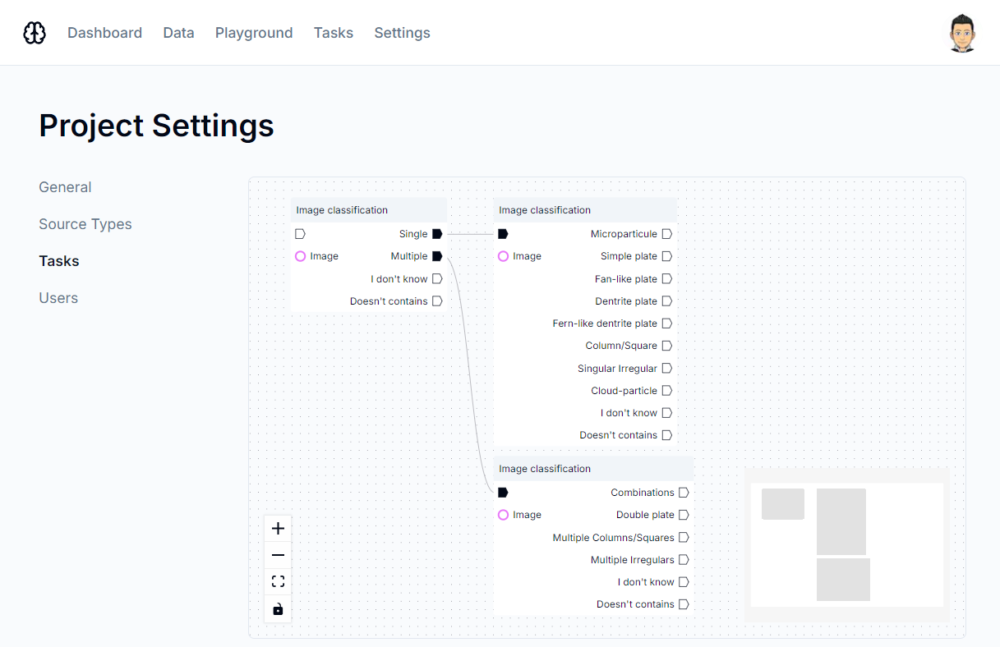

# OntoLearn Annotator

OntoLearn Annotator is a free, open-source crowdsourcing platform compatible with active learning and based on a graph system.



## Features

- **Active learning compatible**: reduce the number of annotations required by introducing active learning.
- **Playground**: allow you to test your model directly via a web interface
- **User management**: control user rights on your projects
- **Extensible**: use one of the proposed interfaces for your annotations (classification, segmentation, transcription, etc.) or create your own interface
- **Easy to use**: create your annotation tasks in just a few clicks using the graph system
- **Multilingual**: the tool is available in English, French and Japanese, and you can easily add your own language.
- **Compatible with Headwork**: if you're already using the [Headwork](https://headwork.irisa.fr/headwork/) crowdsourcing platform, you can easily integrate your project with OntoLearn Annotator.

## Installation

Make sure you have Node.js and Docker installed on your machine. Then, clone the repository and install the dependencies:

```bash
npm install
cp .env .env.local
```

Create the following folder in `public/`:

- `uploads/playground/`
- `img/projects/`

Then, you need to fill the `.env.local` file with your own configuration. You can now start the project:

```bash
docker compose -f ./docker-compose.yml -f ./docker-compose.dev.yml up -d
dotenv -e .env.local -- npm exec prisma migrate dev
npm run dev
```

## Author

Made by [Mathis Boultoureau](https://github.com/mboultoureau)